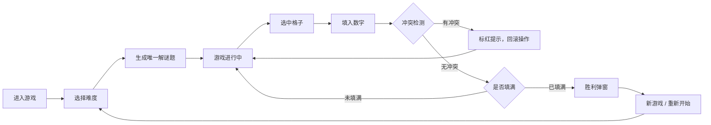

## 1. 产品概述

网页版数独游戏，提供简单/中等/困难三种难度，支持键盘与鼠标双通道操作，实时冲突检测与胜利判定，为用户提供沉浸式的数独解谜体验。

- 核心目标：打造一个功能完整、交互流畅、视觉精美的在线数独游戏
- 目标用户：数独爱好者、休闲游戏玩家
- 产品价值：随时随地享受数独乐趣，锻炼逻辑思维能力

## 2. 核心功能

### 2.1 功能模块

1. **难度选择与谜题生成**：三档难度，回溯算法生成唯一解谜题
2. **棋盘渲染**：9×9网格，三阶宫区分，固定数字与用户数字区分显示
3. **格子选中与高亮**：单击选中，行列宫高亮辅助定位
4. **数字输入**：屏幕按钮与物理键盘双通道输入，支持擦除
5. **冲突检测**：实时检测行/列/宫冲突，冲突数字标红并阻断
6. **胜利判定**：填满无冲突即胜利，弹窗提示并锁定棋盘
7. **重新开始**：清空用户填入数字，恢复初始状态
8. **新游戏**：重新选择难度，生成全新谜题

### 2.2 页面详情

| 页面名称 | 模块名称 | 功能描述 |
|---------|---------|---------|
| 游戏主页面 | 难度选择区 | 简单/中等/困难三个按钮，点击生成对应难度谜题 |
| 游戏主页面 | 状态提示区 | 显示冲突提示、胜利提示等游戏状态信息 |
| 游戏主页面 | 数独棋盘 | 9×9网格棋盘，支持选中、高亮、填入数字 |
| 游戏主页面 | 数字键盘 | 1-9数字按钮和擦除按钮，支持点击输入 |
| 游戏主页面 | 控制按钮区 | 重新开始、新游戏按钮 |

## 3. 核心流程

用户进入游戏 → 选择难度 → 生成谜题 → 点击格子选中 → 通过键盘/按钮填入数字 → 系统实时检测冲突 → 全部填满且无冲突 → 胜利弹窗 → 可选择新游戏或重新开始

## 4. 用户界面设计

### 4.1 设计风格

- **设计主题**：极简优雅风格，柔和的中性色调搭配精致的交互反馈
- **主色调**：深靛蓝 (#1e3a5f) 作为主色，体现逻辑与智慧感
- **辅助色**：柔和蓝 (#3b82f6) 用于选中高亮，暖红 (#ef4444) 用于冲突提示
- **背景色**：浅灰蓝渐变背景，营造舒适的视觉氛围
- **按钮风格**：圆润矩形，微妙阴影，hover 时有轻微上浮效果
- **字体**：使用优雅的无衬线字体，数字清晰易读
- **布局风格**：居中卡片式布局，棋盘为视觉中心，控制区域分布在上下两侧

### 4.2 页面设计概述

| 页面名称 | 模块名称 | UI 元素 |
|---------|---------|---------|
| 游戏主页面 | 难度选择区 | 三个并排的圆角按钮，选中态有明显视觉区分 |
| 游戏主页面 | 状态提示区 | 居中提示文字，冲突时红色显示 |
| 游戏主页面 | 数独棋盘 | 9×9网格，粗边框区分3×3宫格，选中格高亮，行列宫浅色高亮 |
| 游戏主页面 | 数字键盘 | 3×3 数字按钮布局 + 擦除按钮，点击有按压反馈 |
| 游戏主页面 | 控制按钮区 | 重新开始与新游戏按钮，风格统一 |

### 4.3 响应式设计

- 桌面端优先设计，棋盘保持正方形比例
- 移动端适配：缩小棋盘尺寸，数字按钮优化触控区域
- 最小支持宽度：320px

### 4.4 交互动效

- 格子选中：平滑的背景色过渡动画
- 数字填入：数字淡入效果
- 冲突提示：轻微的抖动动画 + 红色闪烁
- 胜利弹窗：缩放淡入动画
- 按钮 hover：轻微上浮 + 阴影加深
