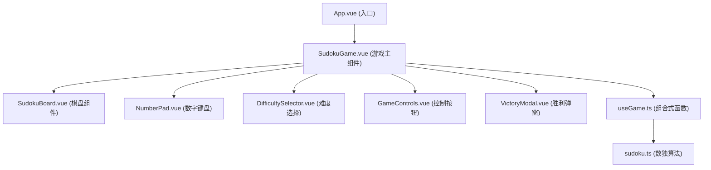

## 1. 架构设计

纯前端单页应用，使用 Vue 3 Composition API 构建，核心算法与游戏逻辑封装在组合式函数中。



## 2. 技术描述

- **前端框架**：Vue 3 + TypeScript + Composition API
- **构建工具**：Vite
- **样式方案**：Tailwind CSS 3
- **状态管理**：Vue reactive/ref (组合式函数封装)
- **核心算法**：回溯法生成终盘 + 随机挖空 + 唯一解验证

## 3. 项目结构

```
src/
├── composables/
│   └── useGame.ts          # 游戏状态与逻辑封装
├── utils/
│   └── sudoku.ts           # 数独核心算法
├── components/
│   ├── SudokuBoard.vue     # 数独棋盘组件
│   ├── NumberPad.vue       # 数字键盘组件
│   ├── DifficultySelector.vue  # 难度选择组件
│   ├── GameControls.vue    # 游戏控制按钮
│   └── VictoryModal.vue    # 胜利弹窗组件
├── App.vue                 # 根组件
├── main.ts                 # 入口文件
└── style.css               # 全局样式
```

## 4. 数据模型

### 4.1 棋盘数据结构

```typescript
// 单元格数据
interface Cell {
  value: number;      // 0 表示空，1-9 表示数字
  isFixed: boolean;   // 是否为初始固定数字
  isConflict: boolean; // 是否冲突
}

// 难度类型
type Difficulty = 'easy' | 'medium' | 'hard';

// 游戏状态
interface GameState {
  board: Cell[][];           // 9x9 棋盘
  selectedRow: number | null;  // 当前选中行
  selectedCol: number | null;  // 当前选中列
  difficulty: Difficulty | null; // 当前难度
  isWon: boolean;             // 是否胜利
  isLocked: boolean;          // 是否锁定棋盘
  message: string;            // 提示信息
  messageType: 'info' | 'error' | 'success'; // 提示类型
}
```

### 4.2 难度挖空数量

| 难度 | 挖空数量 |
|-----|---------|
| 简单 | 30 ~ 35 格 |
| 中等 | 40 ~ 45 格 |
| 困难 | 50 ~ 55 格 |

## 5. 核心算法说明

### 5.1 终盘生成 (回溯法)

1. 从第一格开始逐格填充
2. 随机打乱 1-9 数字顺序，依次尝试
3. 检查当前数字在行、列、宫中是否合法
4. 合法则继续下一格，不合法则回溯
5. 填满所有格子即生成一个完整终盘

### 5.2 挖空与唯一解验证

1. 随机选择一个格子挖空
2. 使用求解算法计算该谜题有多少个解
3. 如果解数为 1，保留挖空；否则回填
4. 重复直到达到目标挖空数量
5. 确保最终谜题有且仅有唯一解

### 5.3 冲突检测

1. 每次填入数字后，检查所在行是否有重复
2. 检查所在列是否有重复
3. 检查所在 3×3 宫是否有重复
4. 任一位置有重复则标记为冲突并回滚操作
